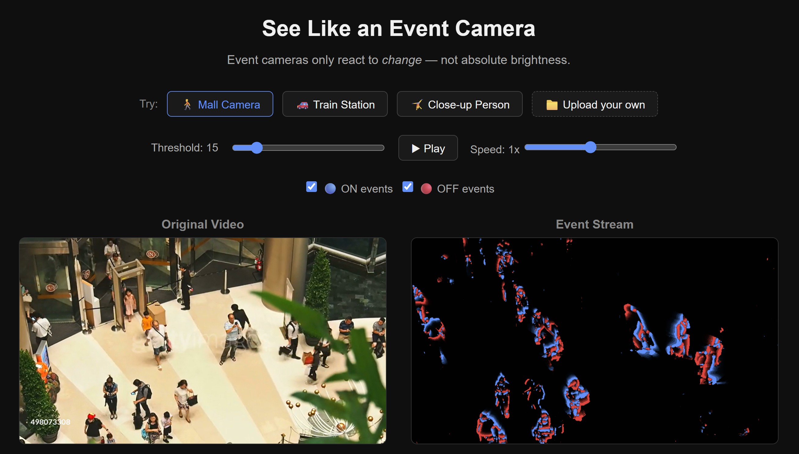

<div align="center">

# 👁️ See Like an Event Camera

[](https://myraadra.github.io/event-vision-playground)
[](LICENSE)

</div>


## 📸 Demo

This demo is an approximate Event Camera Simulator based on Frame-difference. That means it approximates event camera behavior by computing intensity differences between consecutive video frames. Each frame is converted to grayscale, smoothed, and compared to the previous one. Then, pixels with changes above a threshold generate ON/OFF “events".

<div align="center">




</div>

---

## What Is an Event Camera?

Unlike traditional frame-based cameras that capture full images at a fixed rate, **event cameras** (also called Dynamic Vision Sensors, or DVS) operate at the **pixel level**. Each pixel is triggered independently the moment it detects a change in brightness.

This results in:
- **Microsecond temporal resolution** — no motion blur
- **High dynamic range** — works in both pitch dark and direct sunlight
- **Low power consumption** — only transmits event when we have a brightness change.

This simulator lets you experience that paradigm shift directly in your browser.

---

## Features

| Feature | Description |
|---|---|
| 📁 **Upload any video** | Drop any `.mp4` and see its event-camera approximation in real time |
| 🎚️ **Threshold slider** | Tune the contrast sensitivity — from noisy & dense to sparse & clean |
| 🔵🔴 **Polarity toggles** | Show/hide ON events, OFF events, or both independently |
---

## How It Works

#### User-uploaded videos → Frame Differencing Approximation

```
Video frame N  ──┐
                  ├──▶  Grayscale  ──▶  Gaussian Blur  ──▶  Pixel Δ  ──▶  ON/OFF Events
Video frame N-1 ──┘
```

For each pixel:
- `Δ > +threshold` → **ON event** (🔵 blue, brightness increase)
- `Δ < −threshold` → **OFF event** (🔴 red, brightness decrease)
- `|Δ| ≤ threshold` → **silence** (⬛ black, decays)

---

## 🚀 Run Locally

```bash
git clone https://github.com/MyraAdra/event-vision-playground.git
cd event-vision-playground
python -m http.server 8000
```

Then open [`http://localhost:8000`](http://localhost:8000)

---

## 🤝 Contact

**Mira Adra** ~ PhD Student, Event-based Vision & Crowd Surveillance

[](https://www.linkedin.com/in/mira-adra/)

---

<div align="center">

*Built with vanilla JS · No frameworks · No GPU required*

⭐ Star this repo if you found it interesting!

</div>